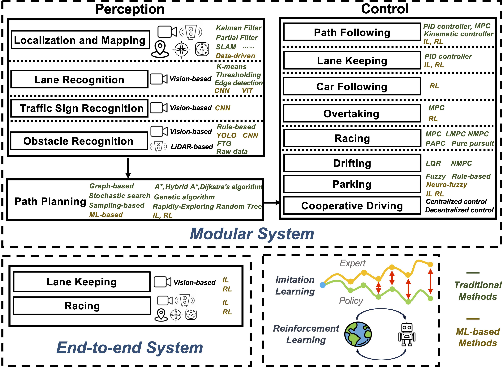

# <p align="center"> **Autonomous Driving Small-Scale Cars** </p> 

<p align="center">
  <a href="https://ieeexplore.ieee.org/document/11034663">
    
  </a>
  <a href="https://arxiv.org/abs/2404.06229">
    
  </a>
</p>


This repository collects and summarizes recent research, toolkits, and hardware approaches for autonomy on small-scale cars (e.g., 1/10–1/5 scale platforms, micro‑UAV‑sized ground vehicles, and robotics education platforms). It covers perception, localization, planning, control, simulation, and representative datasets, with links to code and notable papers. The goal is to provide a practical resource for researchers, students, and hobbyists who want to prototype and evaluate autonomy on physically small vehicles. 

---

## 📝 Citation

If you find this project useful, we'd appreciate a star ⭐ and a citation of our survey.

```bibtex

@article{li2025autonomous,
  author={Li, Dianzhao and Auerbach, Paul and Okhrin, Ostap},
  journal={IEEE Transactions on Intelligent Transportation Systems}, 
  title={Autonomous Driving Small-Scale Cars: A Survey of Recent Development}, 
  year={2025},
  volume={},
  number={},
  pages={1-24},
  keywords={Automobiles;Sensors;Surveys;Hardware;Cameras;Pipelines;Autonomous automobiles;Wheels;Vehicle dynamics;Safety;Small-scale car;autonomous driving;robotics},
  doi={10.1109/TITS.2025.3572394}}

@article{li2024towards,
  title={Towards autonomous driving with small-scale cars: A survey of recent development},
  author={Li, Dianzhao and Auerbach, Paul and Okhrin, Ostap},
  journal={arXiv preprint arXiv:2404.06229},
  year={2024}
}

```

## 📋 Table of Contents


1. [Motivation](#-motivation)
2. [Hardware](#️-hardware)
3. [Software](#-software)
4. [Licence](#-licence)
5. [Contact](#-contact)	


## 🎯 Motivation

* A concise literature survey and annotated bibliography of recent papers and projects.
* A comparison of common small‑scale platforms (hardware, sensors, compute).
* Recommended datasets and simulators for development and benchmarking.
* Example code snippets and pointers to open-source implementations (perception, planning, control).
* Suggested experiment recipes and evaluation metrics for reproducible research.


<div align="center">
  
  <br>
</div>

*Figure 1: Illustration of the development and current states of small-scale car platforms, each depicted platform image sourced from its respective paper or website. (A) Based on published studies each year on Google Scholar with the search terms: "small-scale car" or "robot car", the research on small-scale cars has seen substantial growth in the number of papers over the years. In the early 2000s, projects like s-bot, e-puck, and TurtleBot emerged. Starting around 2016, with the introduction of Duckietown, BARC, and Autorally, there was a significant increase in research papers. This trend continued with the development of projects like DeepRacer, Donkeycar, and F1TENTH. More computationally advanced small-scale cars have been introduced in recent years, such as ART/ATK and XTENTH-CAR. (B) Examples of small-scale car platforms, categorized into educational platforms and research platforms, including multiple vehicle setups such as ORAC, ICAT, UDSSC and MCCT.*


---


## 🛠️ Hardware


We summarized platform details in table, wchich compares hardware characteristics, including steering dynamics, actuators, sensors, and costs. It outlines software frameworks, simulation tools, and primary focus tasks, serving as a reference for specific driving behaviors.


| **Platforms** | **Size** | **Vehicle Dynamics** | **Wheel Configuration** | **Actuator** | **Sensors** | **Computation Unit** | **Runtime** | **Commercial available** | **Price (USD)** |
|--------------|----------|----------------------|------------------------|--------------|-------------|----------------------|-------------|-------------------------|------------------|
| [AutoRally](https://ieeexplore.ieee.org/document/8616931) | 1/5th | Ackermann | Four wheels | Two servo motors | Camera, IMU, GPS, Hall-effect sensor | Intel i7-6700, Nvidia GTX-750ti SC | <1h | ❌<br>[Build guide](https://github.com/AutoRally/autorally/wiki/Build-Guide) | 10,000 |
| [ART/ATK](https://arxiv.org/abs/2206.06537) | 1/6th | Ackermann | Four wheels | One brushless DC motor, One servo motor | Camera, 3D LiDAR | Jetson Xavier NX | -- | ❌ | -- |
| [BARC](https://www.taylorfrancis.com/chapters/edit/10.1201/9781315265285-121/autonomous-drifting-onboard-sensors-gonzales-zhang-li-borrelli) | 1/10th | Ackermann | Four wheels | One brushless DC motor | Camera, LiDAR, IMU, GPS | ODROID-XU4 | -- | ❌ | -- |
| [Donkeycar](http://donkeycar.com) | 1/10th, 1/16th | Ackermann | Four wheels | One brushed/brushless DC motor | Camera, LiDAR, IMU, Encoder | RPi/Jetson Nano | ✔️ | ❌ | 350 |
| [F1TENTH](https://proceedings.mlr.press/v123/o-kelly20a.html) | 1/10th | Ackermann | Four wheels | One brushless DC motor | Camera, LiDAR, IMU | Jetson TX2 | <1h | ❌ | 3,800 |
| [RACECAR(MIT)](https://ieeexplore.ieee.org/abstract/document/7910242) | 1/10th | Ackermann | Four wheels | One brushless DC motor, One servo motor | Camera, LiDAR, IMU, Encoder | Jetson Tegra X1 | -- | ❌ | 2,600 |
| [MuSHR](https://arxiv.org/abs/1908.08031) | 1/10th | Ackermann | Four wheels | One brushless DC motor, One servo motor | Camera, LiDAR, IMU, Bump sensor | Jetson Nano | -- | ❌ | 900 |
| [Qcar](https://www.quanser.com/products/qcar) | 1/10th | Ackermann | Four wheels | One brushless DC motor | Camera, LiDAR, IMU, Encoder, Microphone | Jetson TX2 | 30m~2h | ✔️ | -- |
| [Autominy](https://autominy.github.io/AutoMiny/) | 1/10th | Ackermann | Four wheels | One brushless DC Servomotor | Camera, LiDAR, IMU, Encoder | Intel NUC | -- | ❌ | -- |
| [JetRacer]( https://github.com/NVIDIA-AI-IOT/jetracer) | 1/10th, 1/18th | Ackermann | Four wheels | One brushed DC motor | Camera | Jetson Nano | -- | ✔️ | 600 |
| [Autonomouscar](https://www.mdpi.com/1424-8220/21/11/3850) | 1/10th | Ackermann | Four wheels | One brushed DC motor | Camera, LiDAR, IMU, Encoder, ToF Sensor, Indoor GPS | RPi 4 | -- | ❌ | -- |
| [CoRoLa](https://ieeexplore.ieee.org/abstract/document/9860981) | 1/10th | Ackermann | Four wheels | One brushless DC motor, One servo motor | Camera, Encoder, Ultrasonic sensor | RPi 4 | -- | ❌ | -- |
| [AutoDRIVE](https://www.mdpi.com/2218-6581/12/3/77) | 1/14th | Ackermann | Four wheels | Two DC geared motors | Camera, LiDAR, IMU, Encoder, Indoor GPS | Jetson Nano | -- | ❌ | -- |
| [PiRacer](https://www.waveshare.com/wiki/PiRacer_AI_Kit) | 1/16th | Ackermann | Four wheels | Two DC brushed motors | Camera | RPi 4 | -- | ✔️ | 250 |
| [Duckietown](https://ieeexplore.ieee.org/document/7989179) | 34x15x23cm | Differential | Two wheels, one omni-wheel | Two DC geared motors | Camera, IMU, Ultrasonic sensor | RPi 2/Jetson Nano | 2~6h | ✔️ | 450 |
| [DeepRacer](https://ieeexplore.ieee.org/abstract/document/9197465) | 1/18th | Ackermann | Four wheels | One brushless DC motor, One servo motor | Camera, LiDAR, IMU | Intel Atom | ~6h | ✔️ | 400 |
| [µcar](https://ieeexplore.ieee.org/document/9654986) | 1/18th | Ackermann | Four wheels | One brushless DC motor, One servo motor | IMU, Encoder | RPi Zero W | ~6h | ❌ | -- |
| [UDSSC MCAV](https://www.sciencedirect.com/science/article/pii/S2405896318307456) | 1/25th | Ackermann | Four wheels | One geared DC motor | IMU, line following, IR sensor | RPi 3 | 90m | ❌ | -- |
| [Chronos](https://ieeexplore.ieee.org/document/10161434) | 1/28th | Ackermann | Four wheels | Brush motor with gearbox | IMU, Encoder | Espressif ESP32 | 30m~1h | ❌ | -- |
| [Go-CHART](https://ieeexplore.ieee.org/document/9341770) | 1/28th | Differential | Four wheels | Four micro metal gear motors | Camera, LiDAR, Bump sensor | RPi 3 | ~1h | ❌ | -- |
| [Cambridge Minicar](https://ieeexplore.ieee.org/stamp/stamp.jsp?arnumber=8794445) | 75x81x197mm | Ackermann | Four wheels | -- | Indoor positioning system | RPi Zero | 2h | ❌ | -- |
| [ORCA Racer](https://onlinelibrary.wiley.com/doi/abs/10.1002/oca.2123) | 1/43th | Ackermann | Four wheels | -- | IMU, Indoor positioning system | ARM Cortex M4 | 20m | ❌ | -- |
| [Epuck](https://www.researchgate.net/publication/37468823_The_e-puck_a_Robot_Designed_for_Education_in_Engineering) | 70mm diameter | Differential | Two wheels | Two stepper motors | Camera, IMU, IR sensor, Speaker, Microphone | STM32F407 | ~3h | ✔️ | 1,000 |
| [Turtlebot3](https://www.turtlebot.com) | 14x18x19cm | Differential | Two wheels, one omni-wheel | Two servomotors | Camera, LiDAR, IR sensor | RPi 4 | ~2.5h | ✔️ | 1,200 |
| [Kilobot](https://ieeexplore.ieee.org/document/6224638) | 33mm diameter | Vibration | -- | Two vibration motors | IR sensor | Atmega 328 | 3~10h | ✔️ | 15 |
| [GRITSBot](https://ieeexplore.ieee.org/document/7139767) | 31x30mm | Differential | Two wheels | Two stepper motors | IMU, IR sensor | Atmega 328 | 1~5h | ❌ | -- |
| [HydraOne](https://www.usenix.org/conference/hotedge19/presentation/wang) | 27x32cm | Omni | Four mecanum wheels | Two encoder motors | Camera, 3D LiDAR, Encoders | Jetson TX2 | -- | ❌ | 7,200 |
| [Pheeno](https://ieeexplore.ieee.org/document/7397909) | 10cm diameter | Differential | Two wheels | Two micro gear motors | Camera, IMU, Encoder, IR sensor | ATmega328P, ARM Cortex-A7 | 5h | ❌ | 270 |
| [Thymio](https://ieeexplore.ieee.org/document/6705527) | 11x11cm | Differential | Two wheels, one omni-wheel | Two DC motors | IR sensor, Accelerometer, Microphone, Thermistor | PIC24F | 2h | ✔️ | 270 |
| [MarXbot](https://ieeexplore.ieee.org/document/5649153) | 17cm diameter | Differential | Two treels (track and wheels) | -- | Camera, IMU, IR sensor, 2D force sensor | ARM 11 processor | -- | ❌ | -- |
| [WolfBot](https://ieeexplore.ieee.org/document/6820632) | 17.5cm diameter | Omni | Three mecanum wheels | -- | Camera, IMU, IR sensor, Microphone | BeagleBone | -- | ❌ | -- |
| [LabRAT](https://ieeexplore.ieee.org/document/5354322) | - | Differential | -- | Two DC gearmotors | IR sensor | Atmega324p | 3h | ❌ | -- |
| [Jetbot](https://jetbot.org) | - | Differential | Two wheels, one omni-wheel | Two TT motors | Camera, IMU | Jetson Nano | 2~3h | ✔️ | 250 |


---

## 💻 Software


<div align="center">
  
  <br>
</div>

*Figure 2: Classification of research in small-scale cars into modular and end-to-end systems. Modular systems are further subdivided into perception tasks, planning tasks, and control tasks.*

| **Platforms**      | **Software Programming** | **Simulation Platform** | **User Manual** |
|--------------------|-------------------------|------------------------|-----------------|
| ART/ATK            | ROS2                    | [Chrono](https://projectchrono.org/)|  ❌              |
| MuSHR              | ROS                     | --                     |[Link](https://mushr.io/)              |
| Qcar               | ROS, Python, MATLAB     | Gazebo                 |  ❌              |
| Autominy           | ROS                     | Gazebo                 | [Link](https://autominy.github.io/AutoMiny/)              |
| AutoDRIVE          | ROS                     | [AutoDRIVE Simulator](https://autodrive-ecosystem.github.io/)    | [Link](https://autodrive-ecosystem.github.io/)              |
| WolfBot            | ROS                     | MATLAB                 |  ❌              |
| HydraOne           | ROS                     | --                     | [Link](https://weisongshi.org/hydraone/)              |
| Turtlebot3         | ROS                     | [Gazebo](https://emanual.robotis.com/docs/en/platform/turtlebot3/simulation/)                 | [Link](https://www.turtlebot.com/turtlebot3/)              |
| RACECAR(MIT)       | ROS                     | [Gazebo](https://github.com/mit-racecar/racecar_gazebo)                 |  [Link](https://github.com/mit-racecar)              |
| Donkeycar          | Python                  | [Gym-Donkeycar](https://github.com/tawnkramer/gym-donkeycar)      |  [Link](https://docs.donkeycar.com/)              |
| Duckietown         | ROS                     | Gazebo,[Gym-Duckietown](https://github.com/duckietown/gym-duckietown) | [Link](https://duckietown.com/)      |
| PiRacer            | ROS                     | --                     |  [Link](https://www.waveshare.com/wiki/PiRacer_Pro_AI_Kit)              |
| Jetbot             | ROS                     | Gazebo                 |  [Link](https://jetbot.org/master/)      |
| Autonomouscar      | ROS, LabVIEW            | --                     |  ❌      |
| AutoRally          | ROS                     | Gazebo                 |  [Link](https://autorally.github.io/)              |
| BARC               | ROS                     | --                     | ❌              |
| F1TENTH            | ROS                     | Gazebo, [F1TENTH Gym](https://github.com/f1tenth/f1tenth_gym)|  [Link](https://github.com/f1tenth)              |
| JetRacer           | --                      | --                     |[Link](https://github.com/NVIDIA-AI-IOT/jetracer)              |
| DeepRacer          | ROS                     | Gazebo                 | [Link](https://aws.amazon.com/de/deepracer/)              |
| ORCA Racer         | C++                     | --                     |  ❌              |
| Epuck              | ROS                     | Enki, [Webots](https://cyberbotics.com/), V-REP, [ARGoS](https://www.argos-sim.info/) | [Link](https://e-puck.gctronic.com/)              |
| Kilobot            | --                      | V-REP                  |  [Link](https://github.com/yorkrobotlab/openkilo)              |
| GRITSBot           | --                      | --                     |  ❌              |
| Pheeno             | Python                  | --                     |  [Link](https://acslaboratory.github.io/pheeno-v1/pheeno_construction_content/)              |
| MarXbot            | ROS                     | Gazebo                 |  ❌              |
| LabRAT             | C                       | Player/Stage           |  ❌              |
| CoRoLa             | ROS2                    | Based on LGSVL         | ❌              |
| µcar               | C++, Matlab             | --                     |  [Link](https://cpm.lrt.unibw.de/vehicle/)              |
| UDSSC MCAV         | ROS                     | SUMO                   |  ❌              |
| Chronos            | ROS                     | --                     |  [Link](https://www.gitlab.ethz.ch/ics/crs/-/tree/main)              |
| Go-CHART           | ROS                     | --                     |  ❌              |
| Cambridge Minicar  | Python                  | --                     |  ❌            |

## 📄 Licence

This repository is provided under the **MIT License** by default — change as needed.

---


## 📬 Contact

Questions, suggestions, or contributions? Open an issue or reach out via GitHub.

---


